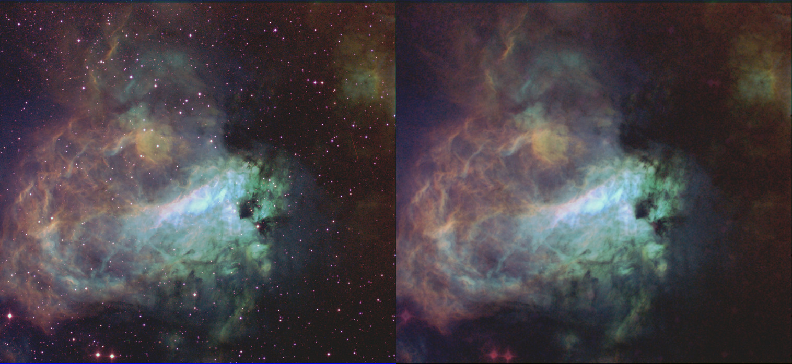

# starreduction
A GAN model trained to remove stars from astronomical images. Code was inspired from a [sample at Tensorflow's website](https://www.tensorflow.org/tutorials/generative/pix2pix). The training data consists of only two images. One image of the Antenna Galaxy and another is a starmap that was created from a star cluster image. Here is how the results look like:




## Running using Docker (Recommended)

```
docker run   -v $PWD:/usr/src/app/starreduction/data   -it code2k13/starreduction  /bin/bash -c "./removestars.py ./data/example.jpg  ./data/example_starless.jpg"
```
Note that *$PWD* refers to your current working directory. In the above example it is assumed that the file *example.jpg* resides in your current working directory. This directory is mounted as a volume with the path */usr/src/app/starreduction/data* inside the docker container. The output image *example_starless.jpg* will also be written to same directory.


## Running without Docker
Clone the repository and navigate to the 'starreduction' folder. Install required packages :

```shell
pip install -r requirements.txt
```

Additionally you may also have to install lfs support for git
```
git clone https://github.com/code2k13/starreduction.git
cd starreduction
sudo apt-get install git-lfs
git lfs pull
```

Run inference on image. 
```shell
python removestars.py image_with_stars.jpg  image_without_stars.jpg
```

> Supprots greyscale and RGB images. Alpha channel (if any) in the source image is removed during processing. Gives issues on some types of TIFF files.


## Training model on your images

The [notebook](train/star-removal-from-astronomical-images-with-pix2pix.ipynb) is available in the train folder.

You can also view/run it on Kaggle:
[https://www.kaggle.com/finalepoch/star-removal-from-astronomical-images-with-pix2pix](https://www.kaggle.com/finalepoch/star-removal-from-astronomical-images-with-pix2pix)


## Attribution

The training images used in this code were sourced from Wikimedia Commons and processed using GIMP.

### Antennae Galaxy Image
This image was downloaded from Wikimedia Commons and converted to grayscale using GIMP by me for purpose of training the model.

Link to processed image: [training_data/Antennae_galaxies_xl.png](training_data/Antennae_galaxies_xl.png)

>[NASA, ESA, and the Hubble Heritage Team (STScI/AURA)-ESA/Hubble Collaboration](https://commons.wikimedia.org/wiki/File:Antennae_galaxies_xl.jpg), Public domain, via Wikimedia Commons

Url : [https://commons.wikimedia.org/wiki/File:Antennae_galaxies_xl.jpg](https://commons.wikimedia.org/wiki/File:Antennae_galaxies_xl.jpg)

Direct Link: [https://upload.wikimedia.org/wikipedia/commons/f/f6/Antennae_galaxies_xl.jpg](https://upload.wikimedia.org/wikipedia/commons/f/f6/Antennae_galaxies_xl.jpg)


### Star cluster NGC 3572 and its surroundings
This image was downloaded from Wikimedia Commons and star mask was created by me using GIMP

Link to the processed image: [training_data/star_map_base.png](training_data/star_map_base.png)

>[ESO/G. Beccari](https://commons.wikimedia.org/wiki/File:The_star_cluster_NGC_3572_and_its_dramatic_surroundings.jpg"), [https://creativecommons.org/licenses/by/4.0] (via Wikimedia Commons) 

Url: [https://commons.wikimedia.org/wiki/File:Antennae_galaxies_xl.jpg](https://commons.wikimedia.org/wiki/File:Antennae_galaxies_xl.jpg) 

Direct Link: [https://upload.wikimedia.org/wikipedia/commons/9/95/The_star_cluster_NGC_3572_and_its_dramatic_surroundings.jpg](https://upload.wikimedia.org/wikipedia/commons/9/95/The_star_cluster_NGC_3572_and_its_dramatic_surroundings.jpg)


